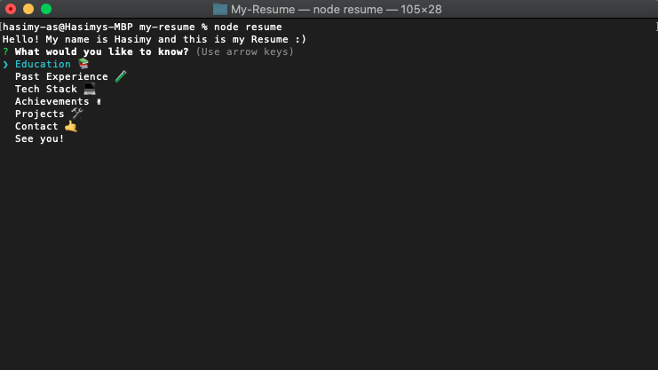

# My-Resume
This shows my Resume through the usage of NPM.


# Usage

Follow the instructions below:

```sh
First, clone/download the repository.

Secondly, run this command in your CLI/Terminal to install the needed dependencies (npm install --save).

Third, if you wanted to add your own data, edit the myData.json file.

Fourth, run the application!

```

# Results
After running the app, you'll arrive at the profile. Here you can just choose which part do you want to know from me :)



## Licensed under the [GPL-3.0](https://raw.githubusercontent.com/hasimy-as/My-Resume/master/LICENSE) License.

Happy coding!
~Hasimy


